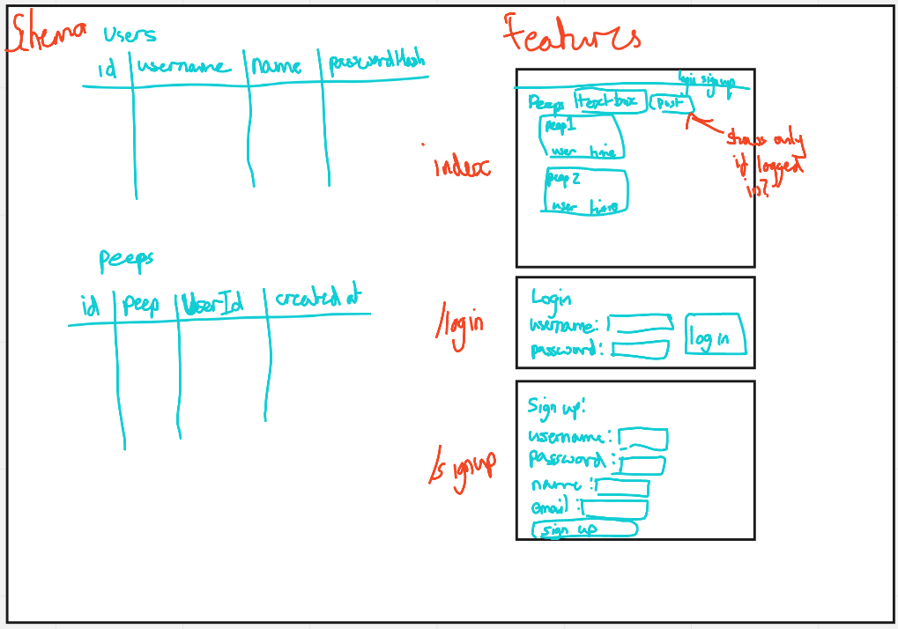

## Quickstart

```
git clone git@github.com:grantwhiteman/chitter-challenge.git && cd chitter-challenge
npm install
npx sequelize-cli db:create
npx sequelize-cli db:migrate
npm start
```
tests:
```
npx cypress open
```

Technologies used: express, ejs, pg, sequelize, cypress, jasmine, postgresql, nodemon, bcryptjs


## Table domain model
|Object|Properties|Messages|Output|
|-----|-----|-----|-----|
|User|Username (unique)|makePeep(@string)|peep|
||Password @hash (unique)|||
||email @string|||
||name @string|||
|Peep|text @string|||
||time @date|||
||User username @string|||
||User name @string|||

## Database structure and website layout models


Features:
-------
### Standard Acceptance Criteria
```
As a trainee software engineer
So that I can let people know what I am doing  
I want to post a message (peep) to chitter

As a trainee
So that I can see what others are saying  
I want to see all peeps in reverse chronological order

As a trainee
So that I can better appreciate the context of a peep
I want to see the time at which it was made

As a trainee
So that I can post messages on Chitter as me
I want to sign up for Chitter

As a trainee
So that only I can post messages on Chitter as me
I want to log in to Chitter

As a trainee
So that I can avoid others posting messages on Chitter as me
I want to log out of Chitter
```

Additional requirements:
------

* You don't have to be logged in to see the peeps.
* Trainee software engineers sign up to chitter with their email, password, name and a username (e.g. ewithers@digitalfutures.com, password123, Edward Withers, dearshrewdwit).
* The username and email are unique.
* Peeps (posts to chitter) have the name of the trainee and their user handle.
* Your README should indicate the technologies used, and give instructions on how to install and run the tests.


### Extended Acceptance Criteria

```
As a trainee
So that I can stay constantly tapped in to the shouty box of Chitter
I want to receive an email if I am tagged in a Peep

As a trainee
In order to start a conversation as a DFA trainee Software Engineer
I want to reply to a peep from another trainee.
```
